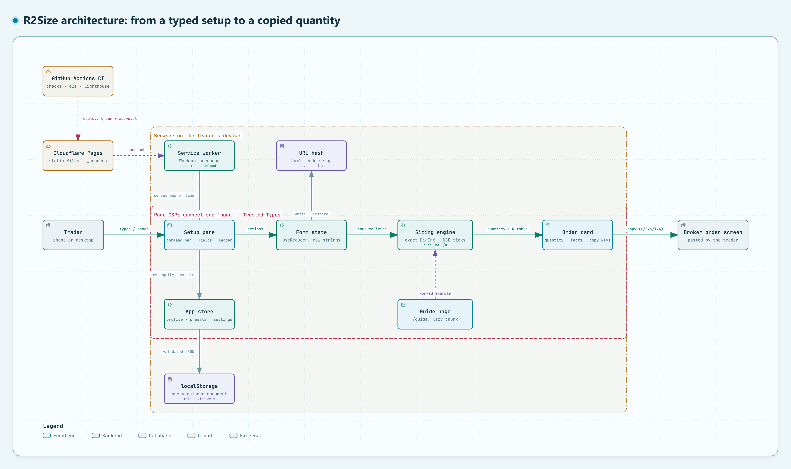

# ⌊R2⌋SIZE

**Risk-first position sizing for Indian swing traders.** Type a setup, and R2Size tells you how many shares to buy so a stopped-out trade loses exactly what you planned, never more. Then copy the numbers into your broker.

**Live:** https://r2size.pages.dev · works offline · installs as an app · nothing leaves your device

---

## What it does

You give it an entry, a stop and how much you're willing to lose. It works out the position:

- **Quantity:** your risk budget ÷ risk per share, **always rounded down** to whole shares (the ⌊ ⌋ in the logo is the floor function).
- **Stop by price, % below entry, or ATR × multiple.** A derived stop is rounded onto the **NSE tick** for that price band.
- **Caps:** the size is also limited by a max allocation % and by your available cash, and the result says which limit applied.
- **Costs:** round-trip charges are included in the risk per share, so the real loss at the stop stays within budget.
- **R table:** P&L after costs at the stop, entry, +1R/+2R/+3R and your targets. These are scenarios, not forecasts.

**Ways to enter a trade:**
- **Fields,** with Enter moving to the next one.
- **Quick-setup line:** `tcs 4012.50 sl 3890 risk 1% cap 20%`.
- **Price ladder:** drag the stop, entry and target lines (↑↓ moves one tick, Shift moves 10). Hovering previews "stop here → N shares".

**Copying to the broker:** `C` / `E` / `S` / `T` / `A` copy the quantity, entry, stop, target or a summary line, as plain digits ready for the broker's order form.

**Remembered on this device:**
- your equity and cash (with a reminder when they're out of date) and presets;
- the current setup, kept in the link so it survives reloads and can be shared. A shared link **never includes your equity or cash**.

**Guide:** at `/guide`, with every term explained, a worked example computed live by the same engine, the dated NSE tick table, and how to check the privacy promise yourself.

## Privacy

R2Size has no server, no accounts, no analytics and no trackers.

- **Your data stays here:** profile, presets and settings live in this browser's storage only. Export/Import moves them between devices.
- **The browser enforces it:** the site's security policy forbids the page from connecting anywhere (`connect-src 'none'`).
- **A test proves it:** an end-to-end test uses every feature and asserts that no request carries anything you typed. It runs against production after each deploy.

## How the quantity is worked out

```
risk budget     = equity × risk %                       (or a ₹ amount)
stop            = entry × (1 − stop %), down to the NSE tick   (or price / ATR × multiple)
risk per share  = (entry − stop) + entry × cost %
quantity        = ⌊ risk budget ÷ risk per share ⌋, then capped by
                  ⌊ equity × max allocation % ÷ entry ⌋  and  ⌊ cash ÷ (entry + entry × cost %) ⌋
```

All money arithmetic uses **exact fractions (BigInt)**, never floating point, so a quantity or tick is never off by rounding. The engine is covered by about 30 hand-checked examples, property tests, a reference implementation that cross-checks 10,000 random setups, 100% branch coverage and mutation testing (≥ 90%).

> NSE assigns each stock's tick monthly from the previous month's close, so near a band edge the auto tick is an estimate and the app says so. You can always override it. BSE may differ. Tick bands: NSE circular NSE/CMTR/67133, effective 15 Apr 2025 (`docs/sources/`).

## Architecture and flow



**Main path (left to right):**
1. The trader types, uses the quick-setup line, or drags the ladder in the **setup pane**.
2. Each change becomes an action on the **form state**.
3. The pure **sizing engine** recalculates the quantity and the R table.
4. The **order card** shows them, and the copy keys put plain digits into the **broker's order screen**.

**Storage and the Guide:**
- The trade setup is written to the **URL hash** (never equity or cash) and restored from it.
- Equity, presets and settings go through the **app store** into **localStorage**, on this device only.
- The **Guide page** runs the same engine on its worked example.

**Boundaries:**
- The outer boundary is the trader's browser.
- The inner one is the page's security policy: no network connections, and Trusted Types.

**Delivery (top):**
1. **GitHub Actions** deploys to **Cloudflare Pages** after green checks and approval.
2. The **service worker** precaches the build so the app runs offline.

*Generated with [archify](https://github.com/tt-a1i/archify) from the source code at commit `6482fe3`; each component is traced to the code that implements it.*

## Tech stack

| | |
|---|---|
| UI | React API on **Preact** (`preact/compat`), TypeScript (strict), CSS Modules, **Base UI** dialogs and popovers |
| Build | **Vite**, **vite-plugin-pwa** (Workbox precache, update only when the user taps Reload) |
| Data | Valibot-validated, versioned document in `localStorage`; setup in the URL hash |
| Tests | **Vitest** + Testing Library + fast-check, **Playwright** (Pixel 7, iPhone 14, desktop) + axe, **Stryker**, **Lighthouse CI** |
| Hosting | **Cloudflare Pages**, deployed from GitHub Actions after green checks and owner approval |

Fonts: Geist and Geist Mono (SIL OFL), subset and self-hosted. Budgets: initial JS ≤ 90 KB, CSS ≤ 15 KB, fonts ≤ 30 KB (currently about 75 / 7 / 21 KB).

## Getting started

Requires **Node 24** and **pnpm 11** (`corepack enable` sets up the pinned pnpm).

```bash
pnpm install
pnpm dev            # http://localhost:5173
```

| Command | What it does |
|---|---|
| `pnpm dev` | Dev server with hot reload (no CSP and no service worker in dev) |
| `pnpm build` / `pnpm preview` | Production build (adds the CSP `<meta>` and `_headers`) / serve it |
| `pnpm typecheck` · `pnpm lint` · `pnpm format:check` | Types, lint (including layer boundaries) and formatting |
| `pnpm test` / `pnpm test:coverage` | Unit and component tests / with coverage |
| `pnpm test:e2e` | Playwright on Pixel 7, iPhone 14 and desktop (needs `pnpm exec playwright install`) |
| `pnpm test:mutation` | Stryker on the sizing engine |
| `pnpm size` | Bundle-size budgets (after a build) |
| `pnpm lhci` | Lighthouse against `wrangler pages dev`, which applies the real headers |
| `pnpm icons` | Regenerate the PNG icons from `scripts/brand/` |

## Project structure

The code is layered, and lint enforces that each layer only uses the ones below it:

```
ui  →  state  →  domain  →  engine
          ↘ infra (browser APIs) ↙
```

```
src/
  engine/     pure sizing maths: exact fractions, NSE ticks, stops, caps, R table (no I/O)
  domain/     formatting (en-IN), all wording, schemas, migrations, presets, share links, backups
  state/      form reducer, app store (profile, presets, settings), quick-setup parser, startup
  infra/      localStorage, clipboard, downloads, URL hash, routing, service worker, install
  ui/         app shell, calculator (three panes), price ladder, Guide, settings, shared parts
config/       the one source of the security policy (CSP <meta> + Cloudflare _headers)
e2e/          Playwright: calculator, offline, update flow, no-network, routing, Guide, a11y
scripts/      size budget, production verification, logo and icon generation
docs/         release checklist, the NSE tick-size circular, and the architecture diagram (images/)
.claude/      product docs: PRD, architecture, design direction, milestone plans
```

Product and technical documents:
- [PRD](.claude/prds/r2size.prd.md)
- [Architecture](.claude/prds/r2size.architecture.md)
- [Design direction](.claude/prds/r2size.design.md)
- [Release checklist](docs/release-checklist.md)

## Deployment

A push to `master` runs the CI pipeline:

1. **Checks:** types, lint, formatting, unit tests with coverage, build, size budgets.
2. **End-to-end tests:** Chromium (Pixel 7 + desktop) and WebKit (iPhone) in parallel, in Playwright's Docker image.
3. **Lighthouse:** performance, accessibility and best practices ≥ 0.9.
4. **Deploy (only if all of the above pass, and only after the owner approves the run in the `production` environment):**
   - uploads to Cloudflare Pages;
   - checks the live site serves the new build with its security headers;
   - runs the no-network test against production.

Manual steps and the device checklist are in [docs/release-checklist.md](docs/release-checklist.md).

## Status

Milestones 1–4 are complete: the sizing engine, the usable calculator, remembering the trader, and installable + offline + deployed. Milestone 5, validating with real swing traders, is next.

R2Size is a calculator, not advice. Position sizing limits a normal loss; it can't prevent a gap below your stop.

## License

No licence has been chosen yet, so all rights are reserved by default.
